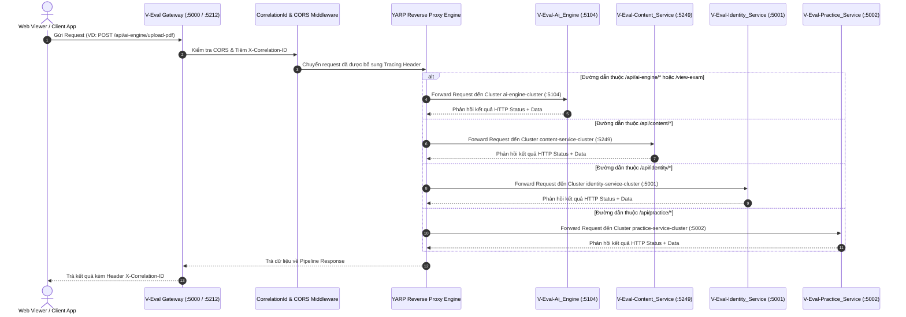

# TÀI LIỆU ĐẶC TẢ KIẾN TRÚC & ĐỊNH TUYẾN API GATEWAY (V-EVAL GATEWAY)

> **Dự án**: Hệ thống cá nhân hóa lộ trình học và luyện thi Đánh giá năng lực tích hợp AI (V-ACT 2026)  
> **Phân hệ phụ trách**: `V-Eval-Gateway` (.NET 9 Web API & YARP Reverse Proxy)  
> **Thời điểm cập nhật**: Tháng 09/2026  
> **Trạng thái**: **100% Hoàn thành & Đã sẵn sàng vận hành (Production Ready)**

---

## 📑 MỤC LỤC
1. [Tổng Quan Kiến Trúc API Gateway](#1-tổng-quan-kiến-trúc-api-gateway)
2. [Sơ Đồ Luồng Định Tuyến (Sequence Diagram)](#2-sơ-đồ-luồng-định-tuyến-sequence-diagram)
3. [Bảng Ma Trận Định Tuyến Routes & Clusters](#3-bảng-ma-trận-định-tuyến-routes--clusters)
4. [Các Cơ Chế Kỹ Thuật Cốt Lõi (Core Technical Features)](#4-các-cơ-chế-kỹ-thuật-cốt-lõi-core-technical-features)
   - 4.1 [Distributed Tracing với X-Correlation-ID](#41-distributed-tracing-với-x-correlation-id)
   - 4.2 [Chính Sách CORS Toàn Cục (Cross-Origin Resource Sharing)](#42-chính-sách-cors-toàn-cục-cross-origin-resource-sharing)
   - 4.3 [Health Check & Giám Sát Trạng Thái Hệ Thống](#43-health-check--giám-sát-trạng-thái-hệ-thống)
5. [Bảng Ma Trận Ánh Xạ File Code (Code Mapping Matrix)](#5-bảng-ma-trận-ánh-xạ-file-code-code-mapping-matrix)
6. [Hướng Dẫn Chạy & Xác Minh Kỹ Thuật (Verification Guide)](#6-hướng-dẫn-chạy--xác-minh-kỹ-thuật-verification-guide)

---

## 1. TỔNG QUAN KIẾN TRÚC API GATEWAY

Trong kiến trúc Microservices của hệ thống V-Eval, **API Gateway (`V-Eval-Gateway`)** đóng vai trò là Cổng giao tiếp duy nhất (Single Entry Point) tiếp nhận toàn bộ các yêu cầu HTTP/REST và gRPC từ phía Client (Web Viewer SPA, Mobile Application, Admin Portal) và chuyển tiếp định tuyến chính xác đến các dịch vụ xử lý nội bộ phía sau (Upstream Microservices).

API Gateway được xây dựng trên nền tảng **.NET 9 Web API** kết hợp giải pháp đảo ngược proxy chuyên dụng **YARP (Yet Another Reverse Proxy v2.3.0)** do Microsoft phát triển, mang lại hiệu năng cực cao, hỗ trợ dynamic routing và dễ dàng tích hợp với các cơ chế bảo mật, rate limiting và distributed tracing.

---

## 2. SƠ ĐỒ LUỒNG ĐỊNH TUYẾN (SEQUENCE DIAGRAM)



---

## 3. BẢNG MA TRẬN ĐỊNH TUYẾN ROUTES & CLUSTERS

Tất cả các quy tắc định tuyến được cấu hình tường minh trong [appsettings.json](file:///e:/CapStone/All%20Services/V-Eval-Gateway/V-Eval-Gateway.API/appsettings.json) dưới phần mục `ReverseProxy`:

| Tên Route ID | Mẫu Đường Dẫn (Match Path) | Tên Cluster ID | Địa Chỉ Service Đích (Upstream Destination) | Chức Năng Nghiệp Vụ Chính |
| :--- | :--- | :--- | :--- | :--- |
| `ai-engine-api-route` | `/api/ai-engine/{**catch-all}` | `ai-engine-cluster` | `http://localhost:5104` | Phân tích PDF đề thi bằng AI, quản lý Background Jobs. |
| `ai-engine-view-route` | `/view-exam` | `ai-engine-cluster` | `http://localhost:5104` | Phục vụ giao diện xem preview đề thi trực quan (HTML SPA). |
| `ai-engine-static-route` | `/extracted_images/{**catch-all}` | `ai-engine-cluster` | `http://localhost:5104` | Phục vụ hình ảnh minh họa cắt từ file đề thi PDF. |
| `content-service-route` | `/api/content/{**catch-all}` | `content-service-cluster` | `http://localhost:5249` | Quản lý ngân hàng câu hỏi, bài đọc chùm, import đề vào Supabase DB. |
| `identity-service-route` | `/api/identity/{**catch-all}` | `identity-service-cluster` | `http://localhost:5001` | Đăng ký, đăng nhập JWT, quản lý liên kết Phụ huynh - Học sinh. |
| `practice-service-route` | `/api/practice/{**catch-all}` | `practice-service-cluster` | `http://localhost:5002` | Làm bài thi trực tuyến, chấm điểm, cập nhật điểm thành thạo kỹ năng. |

---

## 4. CÁC CƠ CHẾ KỸ THUẬT CỐT LÕI (CORE TECHNICAL FEATURES)

### 4.1 Distributed Tracing với X-Correlation-ID
Để đảm bảo khả năng giám sát vết truy vấn xuyên suốt nhiều microservice (Distributed Tracing), `V-Eval-Gateway` tích hợp middleware tự động tiêm mã định danh duy nhất `X-Correlation-ID` cho mọi HTTP request:

```csharp
app.Use(async (context, next) =>
{
    const string correlationIdHeader = "X-Correlation-ID";
    if (!context.Request.Headers.ContainsKey(correlationIdHeader))
    {
        context.Request.Headers[correlationIdHeader] = Guid.NewGuid().ToString();
    }
    context.Response.Headers[correlationIdHeader] = context.Request.Headers[correlationIdHeader];
    await next();
});
```

### 4.2 Chính Sách CORS Toàn Cục (Cross-Origin Resource Sharing)
API Gateway cấu hình chính sách `AllowAll` giúp giao diện Frontend (Web Viewer SPA, React, Flutter) gọi API từ bất kỳ nguồn gốc nào mà không bị trình duyệt chặn truy cập:

```csharp
builder.Services.AddCors(options =>
{
    options.AddPolicy("AllowAll", policy =>
    {
        policy.AllowAnyOrigin()
              .AllowAnyHeader()
              .AllowAnyMethod();
    });
});
```

### 4.3 Health Check & Giám Sát Trạng Thái Hệ Thống
API Gateway cung cấp endpoint `/healthz` giúp hệ thống giám sát (Monitoring tools / Docker / Kubernetes) tự động kiểm tra tình trạng sống của Gateway:

```csharp
app.MapGet("/healthz", () => Results.Ok(new 
{ 
    Status = "Healthy", 
    Service = "V-Eval API Gateway (YARP)", 
    Timestamp = DateTime.UtcNow 
})).WithName("GatewayHealthCheck");
```

---

## 5. BẢNG MA TRẬN ÁNH XẠ FILE CODE (CODE MAPPING MATRIX)

| STT | Phân Hệ / Project | Tên File & Đường Dẫn Code | Trách Nhiệm & Chức Năng Chính |
| :---: | :--- | :--- | :--- |
| 1 | **Gateway API** | [Program.cs](file:///e:/CapStone/All%20Services/V-Eval-Gateway/V-Eval-Gateway.API/Program.cs) | Điểm khởi chạy ứng dụng, nạp middleware CORS, Correlation ID, Health Checks và YARP Reverse Proxy Engine. |
| 2 | **Gateway API** | [appsettings.json](file:///e:/CapStone/All%20Services/V-Eval-Gateway/V-Eval-Gateway.API/appsettings.json) | Tệp cấu hình JSON chứa ma trận bảng định tuyến (Routes) và cụm dịch vụ đích (Clusters). |
| 3 | **Gateway API** | [V-Eval-Gateway.API.csproj](file:///e:/CapStone/All%20Services/V-Eval-Gateway/V-Eval-Gateway.API/V-Eval-Gateway.API.csproj) | Khai báo các gói phụ thuộc NuGet `Yarp.ReverseProxy` v2.3.0 và liên kết các file Protobuf gRPC (`ai.proto`, `content.proto`...). |
| 4 | **Gateway Documentation** | [UPDATE.md](file:///e:/CapStone/All%20Services/V-Eval-Gateway/UPDATE.md) | Nhật ký theo dõi mốc tiến độ phát triển dự án Gateway qua các ngày. |
| 5 | **System Repo** | [UPDATE.md](file:///e:/CapStone/UPDATE.md) | Nhật ký cập nhật toàn hệ thống V-Eval (System-level log). |

---

## 6. HƯỚNG DẪN CHẠY & XÁC MINH KỸ THUẬT (VERIFICATION GUIDE)

### Lệnh Biên Dịch & Kiểm Thử:
```powershell
# Chuyển vào thư mục V-Eval-Gateway
cd "e:\CapStone\All Services\V-Eval-Gateway"

# Thực hiện biên dịch solution
dotnet build

# Chạy dịch vụ Gateway API
dotnet run --project V-Eval-Gateway.API
```

### Kiểm Thử Endpoints:
1. **Kiểm tra Health Check Gateway**: `GET http://localhost:5212/healthz`
2. **Thử nghiệm Forward sang AI Engine**: `GET http://localhost:5212/view-exam`
3. **Thử nghiệm Forward sang Content Service**: `GET http://localhost:5212/api/content/exams`

---
*Tài liệu được biên soạn và lưu trữ chính thức tại:* `docs/api_gateway_yarp_dinh_tuyen.md` và `All Services/V-Eval-Gateway/docs/api_gateway_yarp_dinh_tuyen.md`
